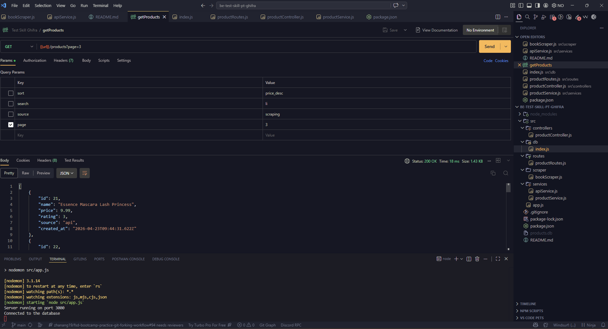

# 🚀 Product Performance API (Backend)

## 📌 Deskripsi Project

Project ini merupakan backend API untuk sistem analisis performa produk.

Sistem mengambil data dari dua sumber:
- Web scraping (books.toscrape.com)
- Public API (DummyJSON)

Data kemudian:
- Dibersihkan (data cleaning)
- Ditransformasi
- Disimpan ke database SQLite
- Disediakan melalui REST API untuk frontend dashboard

---

## ⚙️ Teknologi yang Digunakan

- Node.js
- Express.js
- SQLite
- Axios
- Cheerio (Web Scraping)
- Nodemon
- CORS

---

## 🔄 Data Pipeline

Alur data dalam sistem:

Scraping / API  
↓  
Data Processing (cleaning & transform)  
↓  
Database (SQLite)  
↓  
Backend API  
↓  
Frontend Dashboard  

---

## 🔗 API Endpoint

Base URL: http://localhost:3000/

### 📦 Products

- `GET /products` → mengambil semua produk  
- `GET /products?limit=10` → membatasi jumlah data  
- `GET /products?rating=3` → filter berdasarkan rating  
- `GET /products?name=book` → search berdasarkan nama  
- `GET /products?source=api` → filter berdasarkan sumber  

### Contoh Request:

- http://localhost:3000/products
- http://localhost:3000/products?limit=10
- http://localhost:3000/products?rating=3


### Response Format:

```json
{
  "id": 1,
  "name": "Product Name",
  "price": 50,
  "rating": 4,
  "source": "api"
}
```

---

## 🚀 Cara Install & Menjalankan Project

### 1. Clone repository

```bash
git clone https://github.com/astroceilo/be-test-skill-pt-ghifra
cd be-test-skill-pt-ghifra
```

### 2. Install dependencies

```bash
npm install
```

### 3. Jalankan project

```bash
npm run dev
```

Akses di browser : http://localhost:3000

---

## 🧪 Testing

Pengujian dilakukan secara manual menggunakan Postman dan browser.

### Metode Testing:
- Menguji endpoint API (GET /products)
- Menguji query parameter (limit, rating, dll)
- Menguji input tidak valid

### Hasil Testing:
- Endpoint dapat diakses tanpa error
- Filtering berjalan dengan baik
- API mengembalikan response JSON yang sesuai
- Error handling berjalan dengan baik

---

## 🛠️ Maintenance

### Strategi:
- Struktur modular (route, controller, service)
- Mudah menambahkan sumber data baru
- Query parameter fleksibel

### Pengembangan Selanjutnya:
- Menambahkan authentication
- Scheduler untuk auto scraping
- Automated testing (Jest)
- Logging system

---

## 👨‍💻 Author

Doni Anggara

---

## 📸 Screenshot

### Backend API (Response)

